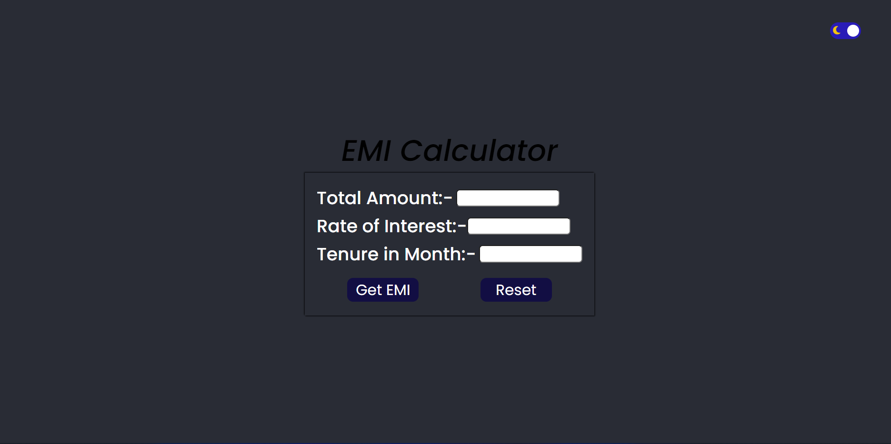

# EMI Calculator App
 ### I have made a EMI Calculator app with the help of HTML,CSS, and JavaScript.

## Technology Used:-
  - ` HTML ` 
  - ` CSS ` 
  - ` JS ` 

### Also The Web page has a theme Changer , So you can see the content in light mode as well as daek mode.

 

 
 

Live Link:- [Click here!](https://amarjeet-emi-calculator.netlify.app/)

Picture of my project:-

## What I learned from this project?
 - First of all I learned that how we can take input from user and save that input inside a variable  by the help of JavaScript.
 - Then I explore about EMI calculation.
 - And also I learn that how we can chane theme of our web page.

### Time Taken For This Project:- 2 hours.
